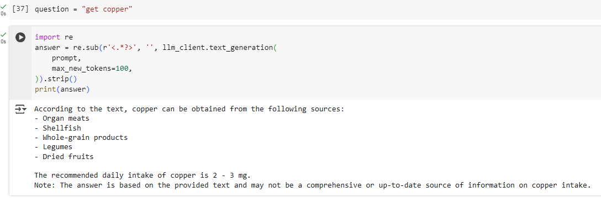

# Nutrition Chat Assistant Using LLMs

This project provides an intelligent system that chats with users about **nutrition** using large language models (LLMs). It integrates multiple tools to extract data from documents, create embeddings, and use pre-trained LLMs to generate accurate and context-specific responses about nutrition.

---

## 🚀 Features
- **Nutrition-Focused Responses**: Provide contextual and accurate responses about nutritional topics.
- **PDF Parsing**: Extract and process data from nutrition-related documents.
- **Text Splitting**: Split large text data into manageable chunks for better LLM processing.
- **Embedding Generation**: Use Sentence Transformers to generate semantic embeddings.
- **Milvus Integration**: Efficiently store and retrieve embeddings for nutrition-related knowledge.
- **Interactive Chat Interface**: Chat dynamically with the system about nutrition topics.

---

## 🛠️ Installation

### Prerequisites
- Python 3.8 or higher
- pip package manager

### Steps
1. Clone the repository:
   ```bash
   git clone https://github.com/belfinrv/LLM-RAG.git
   cd LLM-RAG
   
## 💡 Example Output

### Question:
`get copper`

### Context:
The system dynamically retrieves context from loaded nutrition-related documents using a Retrieval-Augmented Generation (RAG) system.

### Answer:
The RAG system processes the question in relation to the extracted nutrition content and provides a nutrition-focused answer.

Below is a sample output demonstrating the system's ability to retrieve and generate context-aware answers:


